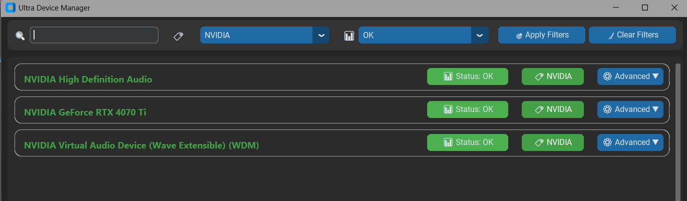

🖥️ Ultra Device Manager
Ultra Device Manager is a modern, customizable device interface manager for Windows, built with CustomTkinter.
Inspired by the native Device Manager — but redesigned for clarity, modularity, and aesthetics.

✨ Features
✅ Live Filter & Search (partial match support)

✅ Status Control (Enable / Disable / Restart devices)

✅ Custom Tags & Metadata

✅ Inline Notes & Label Coloring (click device name to edit)

✅ Windows-like Advanced Actions

Open driver folder

Jump to registry path

Open native device properties

✅ History Logging

✅ Modern Windows 11 Flat Design

customtkinter

wmi (for Windows device info)

tkinter (standard with Python)

bash
Copy
Edit
pip install customtkinter wmi
🚀 Running the App
bash
Copy
Edit
python main.py
🧠 Tips
Click the 🏷 tag button to edit tag

Click the device name to pick a label color

Use filters at the top to narrow by tag, name, or status

📦 Todo / Future Ideas
Export/import device snapshots

Plugin system for driver utilities

Animation effects (e.g., collapsible panels)

Multi-language support